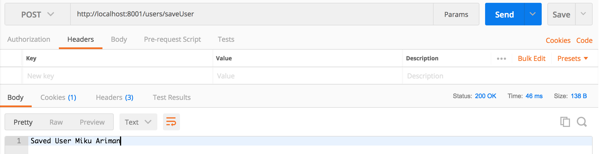
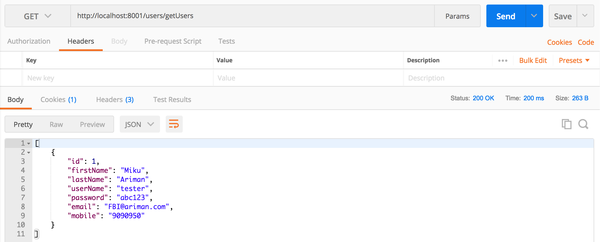

# Demo for Spring Boot integrates with Sqlite Database

## Requirements:
- Java 9
- Gradle 4.6
- Spring Boot 2.0

## Description:
Unlike H2 and some other embedded database, Spring Boot does not provide official example to 
integrate with Sqlite. While Sqlite could be easily integrated with lots of other languages, 
e.g. Python, Javascript, and, there is some nice GUI application working with Sqlite, e.g. 
[DB Browser for Sqlite](http://sqlitebrowser.org/), so Sqlite is sometimes more convenient to 
flexible works.

But unfortunately, there is only a few example codes can be found online and seldom of them 
are working (at least to me), so I would like to add one more for public.

## Usage:

Start demo API:
```commandline
./gradlew bootRun
```

Test Adding User data by sending a Post request to `http://localhost:8001/users/saveUser`:

Test Getting User data by sending a GEt request to `http://localhost:8001/users/getUsers`:


## Feedback
Welcome to raise Issues if you got any failures when running this example.

